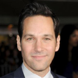
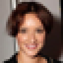
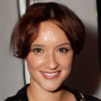
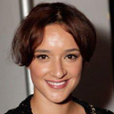
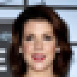
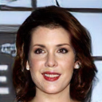
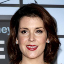

# <center> SRWGAN-GP - Super Resolution Wasserstein GAN with Gradient Penalty <center>

Keras implementation of SRWGAN-GP for 4x face upscaling. Model is based on SRGAN. Generator model is SRResNet with removed batch normalisation layers. Discriminator has decreased number of filters in conv layers and decreased number of units in dense layer to reduce number of parameters from ~21mln to ~5.6mln.
<br/>
Generator's loss is: <br/>
L = -0.001 Adversarial + 0.3 VGG19 + 0.7 MSE. <br/>
<br/>
32x32 face images are upscaled 4x up to 128x128.

from left: LR, SRWGANGP, HR
<p align="center">
  
</p>

# <center> Requirements <center>

- tensorflow-gpu
- keras
- opencv
- scikit-image
- csvkit

# <center> Download CelebA faces Dataset <center>

- Obtain dataset from https://github.com/LynnHo/HD-CelebA-Cropper
- Follow provided steps to obtain high resolution 128x128 cropped faces

## Folder structure:

```
        path_to_dataset
        ├── data/*.jpg
        └── list_landmarks_celeba.txt
```

I used bicubic downsample with 0.65 face factor: <br/>
```console
python hd_celeba.py --data_dir path_to_dataset --crop_size 128 --order 3 --save_format png --face_factor 0.65 --n_worker 32
```

# <center> Create training, validation and test dataset <center>

## Folder structure:

```
        path_to_dataset
        ├── data/*.jpg
        ├── list_landmarks_celeba.txt
        ├
        ├── path_to_cropped_images_directory
        ├── create_dataset.py
        └── list_eval_partition.csv
```

You can obtain 32x32 and 128x128 images split into training, validation and test folders by running:
<br/>
```console
python create_dataset.py --cropped_dir path_to_cropped_images_directory
```
<br/>
Images will be downscaled with bicubic interpolation.
This will also create necessary 'Weights' folder to save trained weights and 'Image' folder structure to save a batch of images after each training epoch.

# <center> Update config file <center>

You should specify paths for data generator threads. They have to point to one directory above image files. <br/>
Replace path_to_dataset with your path.
- example: TRAIN_32_DATA_GENERATOR_PATH = 'path_to_dataset/faces/32/train_imgs' <br/>
Also a path to image files.
- example: LR_TRAIN_IMAGES_PATH = 'path_to_dataset/faces/32/train_imgs/train'

You can also specify other additional options:

- whether to pretrain generator or not <br/>
PRETRAIN_GENERATOR = True
- whether to load pretrained generator weights <br/>
LOAD_PRETRAINED_GENERATOR = False
- pretrain generator model for PRETRAIN_EPOCHS, minimizing only MSE <br/>
PRETRAIN_EPOCHS = 3

- train whole model for NUM_EPOCHS <br/>
NUM_EPOCHS = 50 <br/>
BATCH_SIZE = 32

- number of data generator threads <br/>
NUM_THREADS = 64
- data generator queue size <br/>
MAX_QUEUE_SIZE = 80

- decrease learning rate after LR_DECAY_NO_IMPROVEMENT_EPOCHS epochs <br/>
 in case of pretrained generator: learning rate will decrease when PSNR value on validation set <br/>
 is not increased in consecutive LR_DECAY_NO_IMPROVEMENT_EPOCHS epochs <br/>
 in case of normal training phase: generator's and discriminator's learning rate will decrease <br/>
 when discriminator's training loss is not improved in consecutive LR_DECAY_NO_IMPROVEMENT_EPOCHS epochs <br/>
LR_DECAY_NO_IMPROVEMENT_EPOCHS = 2

- decrease pretrained generator's learning rate by LR_DECAY_PRETRAIN <br/>
LR_DECAY_PRETRAIN = 2.
- decrease learning rate of generator and discriminator by LR_DECAY_FACTOR <br/>
LR_DECAY_FACTOR = 2.

- values from papers: <br/>
number of discriminator updates per generator update <br/>
TRAINING_RATIO = 5 <br/>
gradient penalty weight used in discriminator loss function <br/>
GRADIENT_PENALTY_WEIGHT = 10

- path to save and load a pretrained generator model <br/>
PRETRAINED_GENERATOR_MODEL_PATH = 'Weights/pretrained_gen_model.h5' <br/>
PRETRAINED_GENERATOR_WEIGHTS_PATH = 'Weights/pretrained_gen_weights.h5'
	
	# <center> Start training <center>
	
You can start training by:
```console
python srwgangp_threaded.py
```

# <center> Results <center>
from left: LR, SRWGANGP, HR

<p align="center">
  
  
  
</p>